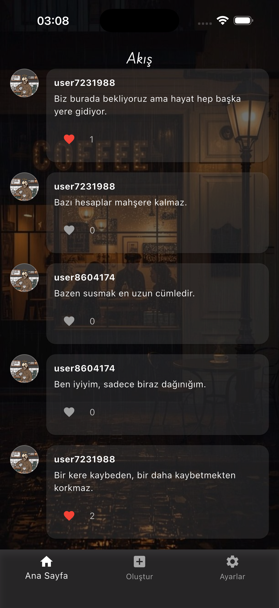
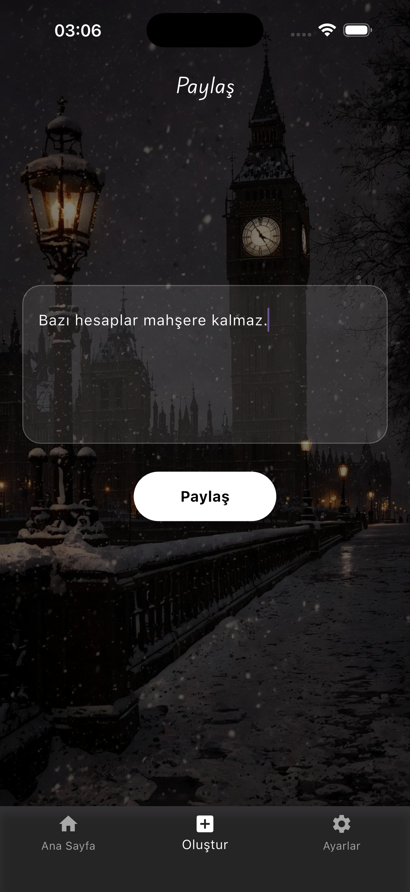
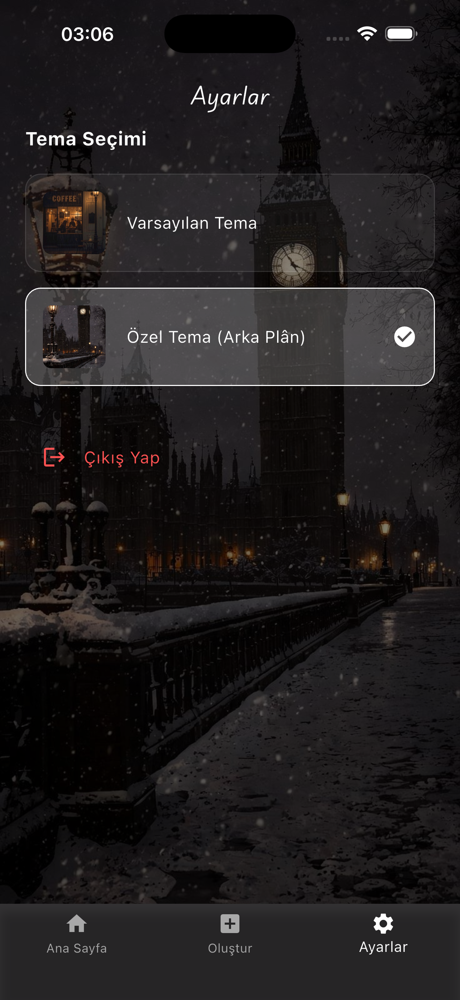

# 📝 Write Only – Anonim Paylaşım Platformu

Bu uygulama, daha önce geliştirdiğim gönderi paylaşma temalı uygulamalardan **farklı olarak**, kullanıcıları **giriş / kayıt modülleri olmadan** sisteme dahil eden anonim bir paylaşım platformu olarak tasarlanmıştır.

Uygulamaya giren her kullanıcı, **`user + rastgele sayı kümesi`** formatında oluşturulan **benzersiz bir ID** ile otomatik olarak **Firebase Cloud Firestore** veritabanına kaydedilir. Böylece kullanıcılar herhangi bir kimlik bilgisi paylaşmadan gönderi oluşturabilir ve etkileşime geçebilir.

---

## 🚀 Temel Özellikler

- 🔐 **Tamamen Anonim Kullanım**  
  Giriş ve kayıt işlemleri olmadan, her kullanıcı rastgele oluşturulan bir ID ile sisteme dahil edilir.

- 📨 **Gönderi Paylaşma**  
  Kullanıcılar anonim olarak gönderi paylaşabilir.

- 📰 **Akış (Feed) Ekranı**  
  Tüm kullanıcıların paylaştığı gönderiler gerçek zamanlı olarak akış ekranında listelenir.

- ❤️ **Beğeni (Like) Sistemi**  
  Gönderiler üzerinde beğeni etkileşimi sağlanarak kullanıcılar arasında anonim etkileşim oluşturulur.

- 🎨 **Özel Font Kullanımı**  
  Uygulamada tipografi için **PlaywriteNZ** fontu entegre edilmiştir.

- ⚙️ **Ayarlar Ekranı**  
  Kullanıcılar ayarlar bölümünden **uygulama arka planını değiştirebilir**.

---

## 🛠️ Kullanılan Teknolojiler

- **Flutter**
- **Firebase Core**
- **Cloud Firestore**
- **Shared Preferences**
- **Custom Font (PlaywriteNZ)**

---

## 📱 Uygulama Ekran Görüntüleri

### 🔐 Giriş (Anonim Başlangıç)

### 📰 Akış Ekranı

### ✍️ Gönderi Paylaşma

### ⚙️ Ayarlar

---

## 📌 Proje Amacı

Bu proje, kullanıcıların **kimlik baskısı olmadan** düşüncelerini paylaşabilecekleri, sade ve etkileşim odaklı bir anonim platform deneyimi sunmayı amaçlamaktadır.  
Aynı zamanda Firebase ve Flutter ekosisteminde **state, veri yönetimi ve kullanıcı etkileşimi** konularında pratik kazanmak hedeflenmiştir.

---

## 📂 Notlar

- Uygulamada **herhangi bir kullanıcı verisi (mail, şifre vb.) tutulmaz**
- Firebase konfigürasyon dosyaları güvenlik sebebiyle `.gitignore` ile hariç tutulmuştur

---

🧑‍💻 Geliştirici: **Mustafa Emir Ata**
